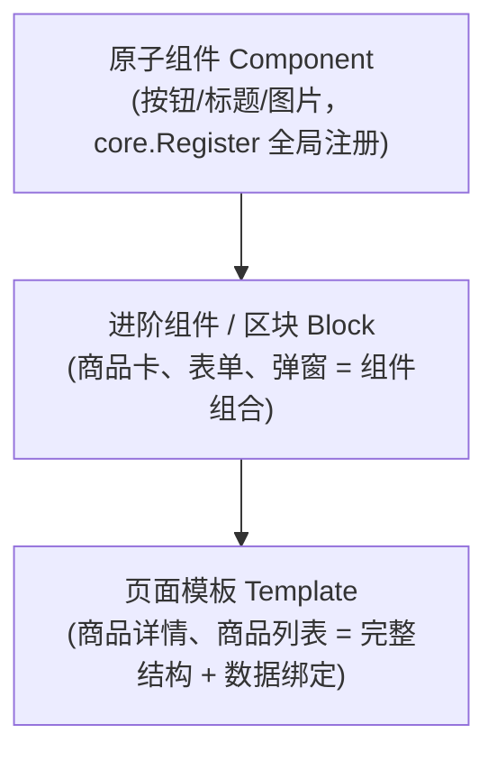
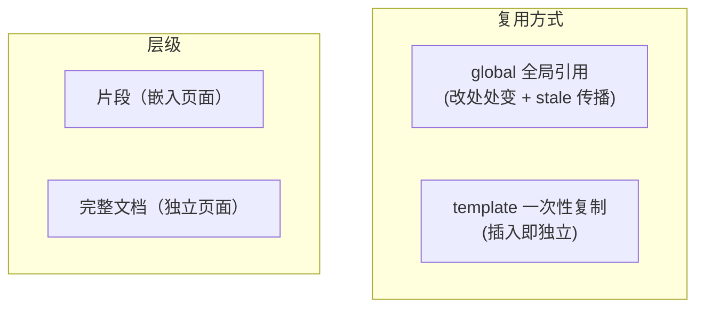
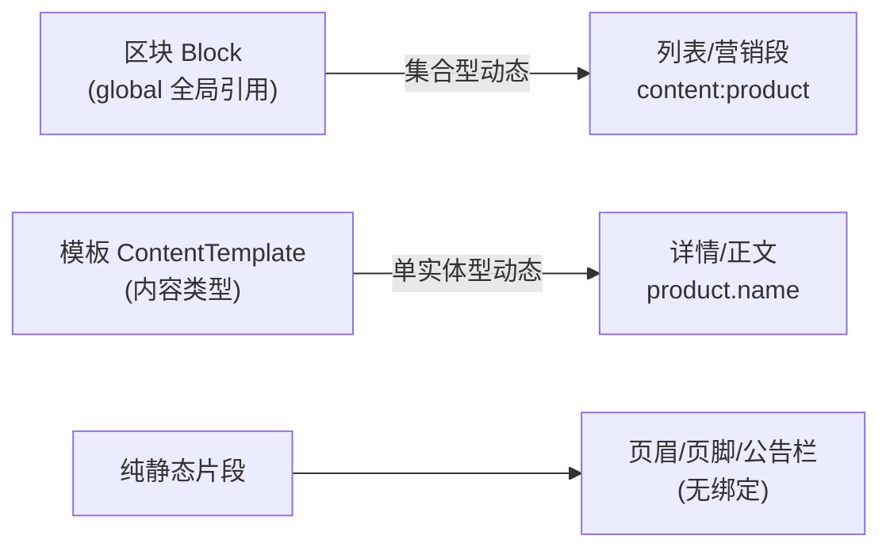
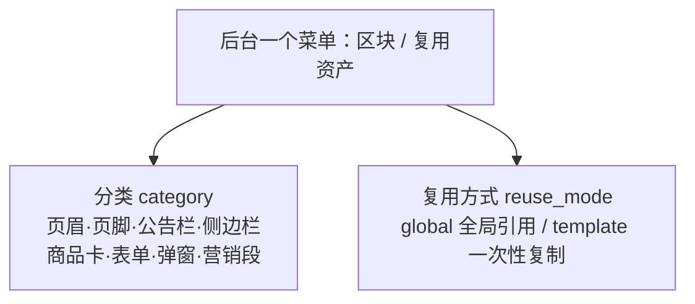

# 02-D · 复用资产与区块改造

> 本文定义 go_wp 的**复用资产体系**：组件（原子）→ 进阶组件/区块（组合片段）→ 页面模板（完整结构）。
> 核心解决两个问题：① 区块类型过少（只有页眉/页脚/区块）；② 「区块 / 模板 / Blueprint / ContentTemplate」
> 四个概念的复用语义易混。
>
> 与本文相关的既有文档：`02-domain.md`（Project/Blueprint/Page/ContentTemplate 领域模型）、
> `06-plugin-system.md`（插件组件与集合绑定）、`03-pipeline.md`（构建与发布）。

## 1. 背景与问题

### 1.1 区块类型过少

当前 `block` 模块只有三种 `kind`（`internal/module/block/model`）：

```go
KindBlock  = "block"   // 普通区块
KindHeader = "header"  // 页眉
KindFooter = "footer"  // 页脚
```

后台「全局块」菜单因此显得单薄。但「区块」的语义本应是**站点级复用片段**——每个页面都可能出现、
需要跨页面强复用、且改一处要让所有引用页面一起更新的结构单元。页眉/页脚只是其中最常见的两种，
远不止于此。

### 1.2 「模板」一词的语义过载

项目里至少有三个概念在口语上都会被称为「模板」，但它们是完全不同的复用语义：

| 概念 | 复用方式 | 改动传播 | 现状 |
|---|---|---|---|
| **Block（全局块）** | 全局引用（页面存 block_id） | 改一处 → stale 传播 → 所有引用页重建 | 已实现 |
| **Blueprint** | 一次性初始化（创建 Page 时复制 AST） | 不传播（用完即弃） | 已实现（0-B） |
| **ContentTemplate** | 内容类型结构（构建期派生快照） | 参与每次构建派生 DocumentSnapshot | 规划/部分实现（0-A2） |

如果不把这个辨析固定下来，后续加「商品卡模板 / 表单模板 / 弹窗模板」时就会混进「区块」，
导致「改一个商品卡，全站所有用过的页面都被 stale 重建」——这大概率不是用户想要的。

## 2. 复用资产的层级

从「原子」到「完整文档」，复用资产是一条**可组合链**：



- **组件**：全局注册的原子构建块，是所有 Page Document 的叶子。不隶属任何页面/主题。
- **进阶组件/区块**：由多个原子组件组合成的可复用片段（如「商品卡 = 图片 + 标题 + 价格 + 按钮」）。这是「进阶组件」的本质——复合组件。
- **页面模板**：完整页面结构 + 数据绑定声明（如「商品详情模板」绑定 `product.*` 字段）。

三者是**一棵树**：组件是最底层，往上逐级组合，不是三个并列的菜单。

## 3. 复用语义的两个正交维度

所有「复用资产」都可以用两个正交维度描述，这是本文的核心框架：

| 维度 | 取值 | 含义 |
|---|---|---|
| **层级** | 片段 / 完整文档 | 片段嵌入页面；完整文档独立成页 |
| **复用方式** | global（引用）/ template（复制） | 引用=改处处变；复制=插入即独立 |



四个既有概念的落位：

| 概念 | 层级 | 复用方式 |
|---|---|---|
| Block（页眉/页脚/区块） | 片段 | global |
| 片段模板（商品卡/表单/弹窗） | 片段 | template |
| ContentTemplate（商品详情结构） | 完整文档 | 构建期派生（第三种，见 §6） |
| Blueprint（整页初始化） | 完整文档 | template（一次性） |

## 4. Block 扩展：区块类型清单

在 `block` 模块的 `kind`/`category` 上扩展，让「区块」名副其实地成为「站点级复用片段库」。

### 4.1 站点骨架（skeleton，全局引用）

| kind | 说明 |
|---|---|
| `header` | 页眉（已有） |
| `footer` | 页脚（已有） |
| `announcement` | 公告栏（促销条，页眉上方） |
| `sidebar` | 侧边栏（博客/商品页侧栏） |
| `breadcrumb` | 面包屑导航 |
| `drawer` | 移动端抽屉导航 |
| `search` | 全局搜索框 |

### 4.2 复用内容段（content，全局引用）

| kind | 说明 |
|---|---|
| `cta` | 全局 CTA 段（订阅/联系） |
| `trust` | 信任徽章/支付方式条 |
| `brands` | 品牌 logo 墙 |
| `contact` | 客服联系方式条 |
| `about` | 「关于我们」简介段 |

### 4.3 布局骨架（layout，全局引用）

| kind | 说明 |
|---|---|
| `banner` | 全宽横幅 |
| `grid` | 多栏布局 |

### 4.4 片段模板（snippet，一次性复制）

| kind | 说明 |
|---|---|
| `snippet` | 片段模板（商品卡/表单/弹窗/营销段），典型配合 `reuse_mode='template'`；细分走 `category`（如 `product-card`/`form`/`modal`） |

> 定案：模板类片段不逐个设 kind（避免 kind 爆炸），统一 `kind='snippet'` + category 细分；`snippet` 也允许 global（强复用的营销段同理可引用）。`globalref` 构建期只展开 `reuse_mode='global'` 的块，template 块被引用展开会直接构建失败（误用防御，见 §9）。

> 以上是「全局引用」的站点级片段。它们被页面通过 `settings.structure`（页眉/页脚槽位）
> 或 `core.globalref`（内联引用）消费，改一处触发 stale 传播。

## 5. reuse_mode 维度：global 与 template

在 `BlockEntity` 上增加 `reuse_mode` 字段，区分两种复用方式：

```go
// ReuseMode 复用方式。
const (
    ReuseGlobal   = "global"   // 全局引用：页面存 block_id，改处处变 + stale 传播
    ReuseTemplate = "template" // 一次性复制：插入时复制完整 AST，之后独立
)
```

### 5.1 global（现状，保持）

- 页面只保存 `block_id`（引用），不保存块内容。
- 构建期经 `BlockResolver` 内联展开块内容。
- 块变更/删除 → `stale` 传播 → 所有引用页面标待重建。
- 适用于：页眉/页脚/公告栏/侧边栏等「站点级强复用」片段。

### 5.2 template（新增）

- 插入页面时**复制完整 AST**（递归生成新 Node ID），页面不再依赖源块。
- 之后编辑互不影响；源块修改**不**触发引用页面重建。
- 复制机制可复用 Blueprint 的「创建 Page 时复制完整 AST」能力（`02-domain.md §1.2` 已有此语义）。
- 适用于：商品卡、表单、弹窗、营销段等「一次性复用」片段。

### 5.3 两者的边界（关键）

> **判断标准：改这个块，用户是否希望「所有用过的页面一起变」？**
> - 希望一起变 → `global`（页眉、公告栏、信任徽章）。
> - 希望各自独立 → `template`（商品卡、表单、弹窗）。

这一判断必须在「插入页面」时由用户显式选择（编辑器里「引用 / 复制」两个动作），
而不是由系统自动猜。

## 6. 数据绑定分工：区块的「动态」边界

复用资产可以带数据绑定，但「动态」分两种，分工不同（详见 `04-A-dynamic-capabilities.md §6`）：

| 绑定类型 | 写法 | 典型产物 | 归属 |
|---|---|---|---|
| 集合型（CollectionSource） | `content:product`（类型） | 商品列表、文章列表、营销卡列表 | 手工 Page + **区块** |
| 单实体型（FieldBinding） | `product.name`（具体实体字段） | 商品详情、文章正文 | ContentTemplate + presentation |

**核心结论**：

- **区块能吃「集合型动态」**——`content:product` 绑定的是「类型」，不绑定具体实体，天然适合全局复用。
- **区块不能吃「单实体型动态」**——`product.name` 绑定「某个具体商品」，全局引用会失去复用性，
  这是 ContentTemplate（内容类型 → 构建期派生快照）的专属。

所以三条清晰的分工线：



## 7. 菜单/入口组织：合并入口，不合并概念

「区块」和「模板」在后台**不拆成两个顶级菜单**，而是共用一个「复用资产」入口，用维度区分：



- 一个菜单 `/admin/blocks`（沿用现有）。
- `category` 承载所有片段类型（骨架/内容段/布局/商品卡/表单/弹窗）。
- `reuse_mode` 区分「全局引用」vs「一次性复制」，编辑器里「引用 / 复制」两个动作对应它。
- 不新增「模板库」顶级菜单——避免导航冗余，且两种语义本就可在一个列表里用维度筛选。

## 8. 数据模型设计

### 8.1 blocks 表（扩展）

在现有 `blocks` 表（`021_blocks.sql`）基础上增加 `reuse_mode` 列：

```sql
-- 迁移：为 blocks 增加复用方式维度
ALTER TABLE blocks
    ADD COLUMN reuse_mode text NOT NULL DEFAULT 'global'
        CHECK (reuse_mode IN ('global', 'template'));
```

对应 `BlockEntity` 增加字段：

```go
type BlockEntity struct {
    // ... 现有字段 Kind / Category / Document ...
    ReuseMode string `gorm:"column:reuse_mode;type:text;not null;default:global"`
}
```

### 8.2 片段模板（template 复用方式）如何落地

两个方案，二选一或并存：

**方案 A：复用 Block（推荐，最小改动）**
- `template` 复用方式的块仍存 `blocks` 表，`reuse_mode='template'`。
- 插入页面时：读块 Document → 复制完整 AST + 递归生成新 Node ID → 写入页面。
- 复用 Blueprint 的「复制 AST」逻辑（抽出公共 helper）。

**方案 B：独立 Template 模块（更重，暂不推荐）**
- 新建 `template` 模块，和 `block` 并列。
- 优点：概念隔离清晰；缺点：又一个模块、又一个菜单（正是 §7 要避免的）。

> 推荐方案 A：`template` 只是 `reuse_mode` 的一个取值，不引入新模块、新菜单。

### 8.3 与 Blueprint 的关系

- `Blueprint` = 整页初始化（完整文档层级），`reuse_mode` 场景里的「片段模板」是片段层级。
- 两者复用同一套「复制 AST + 重新生成 Node ID」机制，但 Blueprint 目标是「完整 Page」，
  片段模板目标是「Page Document 的子树」。
- 不合并：Blueprint 已有版本化流程（`blueprints` + `blueprint_versions`），是完整文档的初始化工具；
  片段模板是 `blocks` 表里 `reuse_mode='template'` 的条目。

## 9. stale 传播分支

现有 stale 传播（`block/service/block_service.go` 的 `propagateStale`）**只对 `reuse_mode='global'` 生效**：

```go
// 块变更/删除后：
//   - reuse_mode = global   → 触发引用方 stale 传播（现有逻辑）
//   - reuse_mode = template → 不传播（已复制的页面独立，源块修改不影响）
func (s *Service) propagateStale(ctx context.Context, blockID string) {
    b, _ := s.m.Get(ctx, blockID)
    if b.ReuseMode == ReuseTemplate {
        return // 一次性复制的片段不传播 stale
    }
    // ... 现有 global 传播逻辑 ...
}
```

同理，删除块时：
- `global` 块被页面引用 → 删除需拦截或降级（引用页面退化为无该块）。
- `template` 块 → 删除无副作用（页面已有副本）。

## 10. 与现有模块的边界（冻结边界）

| 概念 | 负责 | 不负责 |
|---|---|---|
| Component（原子） | 单组件渲染 | 组合、复用策略 |
| Block（`reuse_mode=global`） | 站点级强复用片段 + stale 传播 | 一次性复制、内容类型结构 |
| Block（`reuse_mode=template`） | 一次性复制的片段模板 | stale 传播、版本化 |
| Blueprint | 完整 Page 的版本化初始化 | 片段复用、构建期/运行时渲染 |
| ContentTemplate | 内容实体类型的版本化结构（构建期派生快照） | 全局引用片段、运行时渲染 |

## 11. 实施计划（建议顺序）

| 步骤 | 内容 | 依赖 |
|---|---|---|
| 1 | `blocks` 表加 `reuse_mode` 列（迁移，默认 global） | 无 |
| 2 | `BlockEntity` 加 `ReuseMode` 字段 + model 层读写 | 步骤 1 |
| 3 | `block` service 的 stale 传播按 reuse_mode 分支 | 步骤 2 |
| 4 | 抽出「复制 AST + 重生成 Node ID」公共 helper（从 Blueprint 复用） | 无 |
| 5 | 编辑器「引用 / 复制」两个动作 + 对应 `reuse_mode` | 步骤 2-4 |
| 6 | 扩充 `kind`/`category`（公告栏/侧边栏/CTA 等，见 §4） | 步骤 2 |
| 7 | 前端「复用资产」列表加 `reuse_mode` 筛选 + 分类 | 步骤 2 |

> 步骤 1-3 是「改造区块」的核心（复用语义区分）；步骤 4-7 是「复用资产」的完整化。
> 其中步骤 4 的「复制 AST」机制 Blueprint 已实现，主要是抽取复用。

## 12. 实施记录（2026-09 已落地）

| 步骤 | 状态 | 落点 |
|---|---|---|
| 1 迁移 reuse_mode | ✅ | `public/migrations/049_block_reuse_mode.sql`（CHECK + 索引，幂等） |
| 2 Entity/model | ✅ | `BlockEntity.ReuseMode`；`ListByProject`/`UpdateDocument` 透传；kind 白名单扩至 16 值（§4.1-4.4） |
| 3 stale 分支 | ✅ | `propagateStale(ctx, id, reuseMode)`：template 不传播 |
| 4 复制 AST helper | ✅ | `builder.ClonePageWithNewIDs` / `CloneNodeWithNewIDs`（blueprint 已改用，私有实现删除） |
| 5 引用/复制动作 | ✅ 后端 | `POST /api/block/clone`（`CloneAST`：解析→克隆→返回独立文档）；workbench 前端接线待做 |
| 6 kind/category 扩充 | ✅ | service `kindWhitelist`；管理页新建表单全量选项 |
| 7 列表筛选 | ✅ | `List` 支持 `reuseMode` 过滤；管理页「区块/复用资产」组显示类型 + 复用方式列 |

额外落地的审核项：

- **删除拦截（§9 补强）**：`DeleteReq.Force`；global 块被引用（globalref/structure/主题槽位，经 `CountBlockReference` + `ListThemesByBlockID` 注入检查器）默认拒绝 `ErrBlockInUse`，Force 强删后传播退化。template 块直接删。
- **global→template 切换防御**：`Update` 时仍被引用的 global 块拒绝切换（否则引用悬空）。
- **构建期误用防御**：`page_assemble.go` 的 `blockResolverAdapter` 拒绝展开 `reuse_mode='template'` 的块（构建期报错而非静默渲染）。
- **template 无升级路径**：v1 明确不提供「模板更新批量刷新已插入页面」能力（副本独立是语义特性，不是缺陷）；如需强复用请用 global。

## 关联文档

- [02-domain.md](./02-domain.md) — Project/Blueprint/Page/ContentTemplate 领域模型（权威）。
- [04-A-dynamic-capabilities.md](./04-A-dynamic-capabilities.md) — 动态能力与数据绑定分工。
- [03-pipeline.md](./03-pipeline.md) — 构建与发布（globalref 内联、stale 传播）。
- [06-plugin-system.md](./06-plugin-system.md) — 插件组件与集合绑定（CollectionResolver）。
