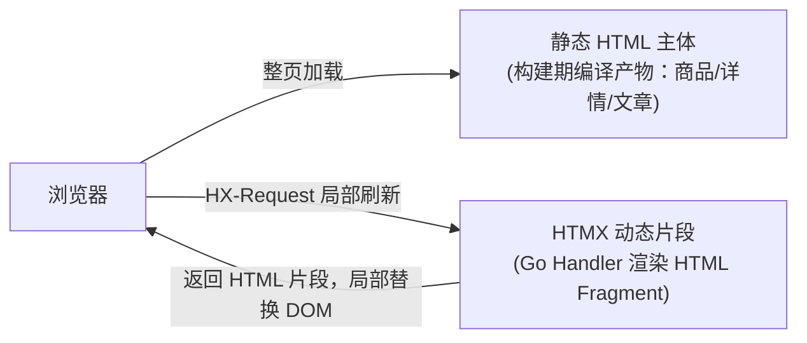
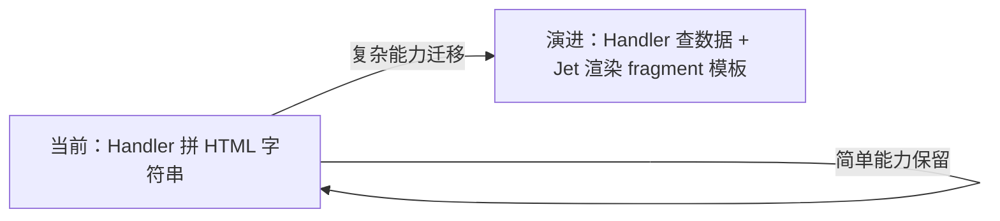
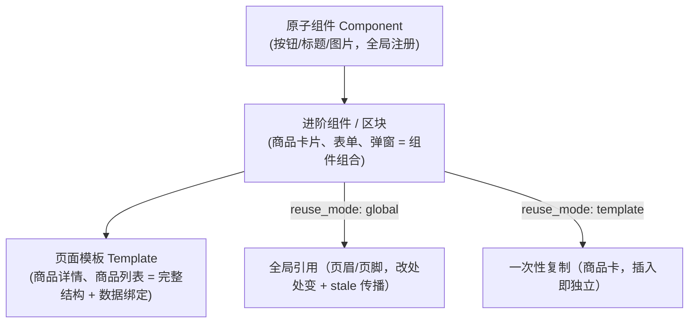

# 04-A · 动态能力落地：HTMX Runtime Fragment 与商品场景

> 本文是 [04-runtime-and-delivery.md](./04-runtime-and-delivery.md)（协议规范）的**能力规划补充**：
> - `04` 讲「怎么**安全地**做动态片段」——协议、安全边界、验收。
> - 本文讲「做**哪些**动态片段、商品场景怎么落、Jet 渲染怎么演进」——能力清单与产品视角。
>
> 二者互补，实现时以 `04` 的协议为准，规划时以本文为准。

## 1. 双层架构：静态主体 + 动态片段

访问面不是「纯静态 vs 动态」的二选一，而是**静态 HTML 主体 + HTMX 动态片段**的双层叠加：

- **静态主体**：构建期由 Jet 把 Page Document 编译为静态 HTML，保证确定性、零查库、可 CDN 长期缓存。
- **动态片段**：页面上的动态区域（筛选结果、分页列表、购物车角标、登录态）通过 `HX-Request` 打到 Fragment Endpoint，Handler 返回一小段 HTML，HTMX 局部替换 DOM。

选择顺序（与 `04 §1.1` 一致）：

1. **发布时可确定**且影响 SEO/首屏语义的 → 静态主体（Build Component）。
2. **需要服务端状态/认证/查询/写操作** → HTMX Runtime Fragment。
3. **纯浏览器交互** → Client Enhancement。

## 2. Jet 在体系中的三个角色

Jet 不只服务于构建期，它有三个角色，统一在 `internal/templates`：

| 角色 | 场景 | 现状 |
|---|---|---|
| 构建期模板 | Page Document → 静态 HTML（发布阶段） | ✅ 已实现 |
| 后台 SSR | 管理界面渲染（`NewJetHTMLRender` 包装为 Gin HTMLRender） | ✅ 已实现 |
| Fragment 渲染 | HTMX 动态片段的渲染 | ⚠️ 演进中（见 §5） |

> 注：当前 Runtime Fragment 的 Handler 是 **Go 直接拼 HTML**（不执行 Jet，见 `04 §1.2`），
> 复杂 fragment 的 Jet 渲染是 §5 的演进方向。

## 3. 商品场景能力落点

| 能力 | 落点 | 说明 |
|---|---|---|
| 商品/详情/文章**静态主体** | 静态构建 | 标题、正文、基础价格、canonical 等 SEO 关键内容必须静态 |
| 商品列表**分页** | 静态分页 or Fragment | 固定分类可静态分页；带筛选时走 Fragment |
| **无限滚动** | Fragment | `hx-trigger="revealed"` 加载下一段，Handler 查库返回列表 HTML |
| **筛选 / 排序 / 搜索** | Fragment | 参数受限（长度/数量/排序枚举），走白名单 capability |
| **购物车 / 登录态 / 库存** | Fragment | session/CSRF 策略，POST 写操作返回新 HTML 状态 |
| 轮播 / 折叠 / 复制文本 | Client Enhancement | 纯浏览器交互，不发起网络请求 |

核心判断标准：

> **这个交互能不能在构建期把结果算好？**
> - 能（固定分类分页、静态列表）→ 静态主体。
> - 不能（任意价格排序、关键词搜索、购物车加购）→ Runtime Fragment。

## 4. Runtime Fragment 现状（0-D 已落地骨架）

`internal/module/runtimefragment/` 已落地完整骨架 + 首批能力 + 测试：

| 文件 | 职责 |
|---|---|
| `registry.go` | capability 白名单（`type → Spec{Render, Auth}`），`Register`/`Lookup`/`Types` |
| `capability.go` | 首批内置能力：`loginPanel`（anonymous）、`cartSummary`（session） |
| `endpoint.go` | `GET /_fragments/:type`：白名单校验 → 认证策略 → 参数限制 → Handler → HTML |
| `router.go` | `SetupFragmentRoutes`（公开路由，session 策略由 endpoint 内部校验） |
| `endpoint_test.go` | 白名单拒绝 / session auth / 参数限制 / 转义 |

安全边界（实现时不可突破，详见 `04 §1.2`）：

- 不接受任意 endpoint：`type` 必须在 Registry 白名单内。
- Handler **不读 Page Document、不执行 Jet、不解释 Binding**。
- 参数长度（≤200）/数量（≤10）/上下文（`currentProduct`/`visitorSession`/`searchQuery` 枚举）受限。
- Handler 输出的用户数据必须经 `html.EscapeString`。

## 5. 演进：从 Go 拼 HTML 到 Jet 渲染复杂 Fragment

**现状问题**：首批能力（`loginPanel`/`cartSummary`）是 Go 代码直接拼 HTML 字符串，
对「商品列表、搜索结果」这类复杂 fragment 会难以维护、模板不可见。

**演进方向**：为复杂 fragment 引入 **Jet 模板渲染**，与构建期/后台 SSR 共用同一套模板引擎：

设计要点：

1. Fragment 模板放 `internal/templates/fragments/`（或 Registry 声明的模板名），与后台/构建期模板隔离。
2. `Spec` 增加模板声明（如 `Template string`），`Render` 先查数据 → 用 Jet 渲染模板 → 返回 HTML。
3. **不突破 §4 的安全边界**：Jet 只做「数据 → HTML」的渲染，数据来自 Handler 白名单查询，仍不接受任意 Binding/endpoint/脚本。
4. 转义策略沿用后台模板规范：文本走 Jet 默认 HTML 转义，用户数据不得 unsafe 原样输出。

> 这条演进不改变「Handler 不解释 Binding」的协议约束——Jet 在这里只是「渲染已经查好的数据」，
> 不是「解释 Page Document 的 Binding」。

## 6. 复用资产与数据绑定

动态能力（列表/详情）依赖「复用资产 + 数据绑定」两层（详见与 `02-domain.md`、`06-plugin-system.md` 的衔接）：

- **数据绑定**：模板里的节点声明 `FieldBinding`（`product.name`，单实体）/ `CollectionSource`（`content:product`，集合）。
- **绑定语义与动态能力的关系**：
  - `CollectionSource`（集合）→ 静态列表（构建期填入）或 Fragment 列表（运行时查库返回）。
  - `FieldBinding`（单实体字段）→ 详情页静态填入（ContentTemplate + presentation，0-A2）。
- **reuse_mode** 区分「全局引用」和「一次性复制」两种复用语义，避免 stale 传播误伤（商品卡模板应是 `template`，页眉/页脚才是 `global`）。

## 7. 待办：首批商品 capability 清单

按依赖顺序落地（均为 `04 §1.2` 协议下的白名单 capability）：

| 优先级 | capability | Auth | 说明 |
|---|---|---|---|
| P0 | `productList` | anonymous | 商品列表片段：分页参数（page/size/排序枚举），返回列表 HTML + 分页骨架 |
| P0 | `searchResults` | anonymous | 搜索片段：关键词受限（长度/分页/排序枚举），`searchQuery` 上下文 |
| P1 | `productAvailability` | anonymous | 库存状态片段（`currentProduct` 上下文） |
| P1 | `productLivePrice` | anonymous | 实时价格片段（`currentProduct` 上下文） |
| P1 | `cartSummary`（补数据） | session | 购物车计数接真实购物车数据（当前 MVP 占位 0） |
| P2 | `cartAdd`（POST） | session + CSRF | 加购写操作，成功后返回新购物车 HTML 状态 |

> 每个 capability 落地时：先在 `registry` 注册 Spec → 实现 Handler（数据查询 + HTML/Jet 渲染）→
> 补 endpoint 测试（白名单/认证/参数/转义）→ 在编译器侧生成 `hx-get` host（fallback 骨架静态固化）。

## 关联文档

- [04-runtime-and-delivery.md](./04-runtime-and-delivery.md) — 协议规范与安全边界（权威）。
- [02-domain.md](./02-domain.md) — 内容实体 / ContentTemplate / DocumentSnapshot 领域模型。
- [06-plugin-system.md](./06-plugin-system.md) — 插件组件与集合绑定（CollectionResolver）。
- [03-pipeline.md](./03-pipeline.md) — 构建与发布管线（静态主体）。
