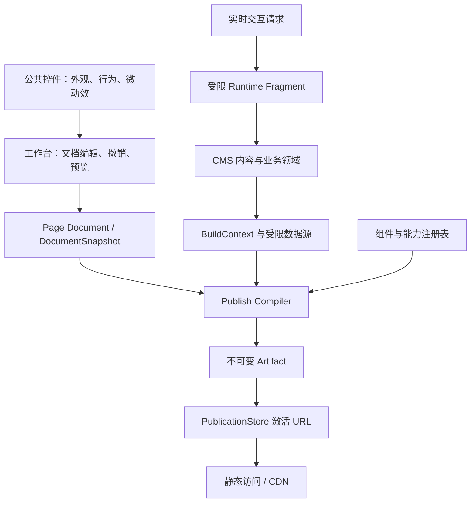

# 基础体系梳理与开源准备

核对日期：2026-09-12。初始基线：`5c1fd27`；生成契约与公共 UI 优化分别提交于 `13059b2`、`c6fc5c5`。本文记录源码现状与工程决策，不承诺兼容 WordPress API 或插件。

## 1. 当前判断

项目已有完整程度较高的静态构建内核，主要短板在编辑器、公共 UI 和资产装配之间的契约。继续添加组件会扩大这些接缝的维护成本；优先收敛它们，比立即更换前端框架或设计完整插件市场更有收益。

「没有原生样式」不适合作为唯一验收标准。原生 input、checkbox、dialog 可以保留语义与键盘能力，但必须有公共外观、可重复的增强入口，以及可观测的失败行为。现在的问题是这三件事没有完全汇合。

已有材料中有几处需要更正：

- 组件目录确为 37 个；基线工作台共有 22 个 JS 文件、5778 行（含嵌套目录），不是 3431 行。行数只说明审查范围，不直接说明设计好坏。
- 普通静态路径不查库、不执行 Jet；Runtime Fragment 是明确的动态出口，其中部分业务能力会现读数据并复用组件渲染。不能把静态路径承诺扩大成「所有访客端点都零查库零模板」。
- 核对时本地 main 相对本地 `origin/main` 领先 294 个提交。没有 fetch，这不是远端实时状态，也不能单凭提交数推断质量。
- 核心 CMS、工作台、发布与存储早已实现，原 README 将它们写成待实现，且仍写 JWT 和旧前端目录。本轮更新了入口说明。

## 2. 用职责理解体系



| 层 | 应拥有 | 不应继续增加的职责 |
|---|---|---|
| 文档与内容 | 内容身份、版本、字段、受限绑定；页面编辑结构 | 在 Document 中保存自由查询或可执行插件逻辑 |
| 编译内核 | 注册、验证、确定性渲染、样式安全、产物依赖 | 识别后台表单、访问数据库模型、解释编辑器 DOM |
| 发布与存储 | Artifact 闭包、URL 占用、激活回执、审计恢复 | 根据每次静态请求重新选择数据库模板 |
| 编辑器 | 节点选择、文档变更、撤销、属性回写 | 再维护一份组件字段键、默认命名和骨架分组知识 |
| 公共 UI | 主题外观、按钮/表单/弹窗行为、焦点和微动效 | 理解 `props.tabs`、商品 API、发布状态机 |
| 扩展装配 | 受限能力声明、验证、依赖注入 | 将全部 `internal` 包直接作为长期公共 SDK |

后台与工作台共用公共 UI 的控制面入口；访问产物仍按使用能力裁剪。共同来源不等于合并两种投递目标。组件动画词汇与效果白名单继续由 Go 管理，不能为了生成便利绕过安全边界。

## 3. 关键接缝清单

| 接缝与源码入口 | 当前护栏 | 优化方向 |
|---|---|---|
| Props 的 `ct:` 标签 → Inspector 字段/分组 | schema 已从 Go 结构产生 | 对未知控件 kind、缺失 slot 补启动或构建期覆盖验证 |
| tabs/accordion 数组键 → 服务端骨架 → JS 对齐 | **本轮**：组件声明、注册反射验证、生成 JS、漂移检查 | 同类组件复用这一能力；普通数组和递归数组分别建模 |
| Palette 默认节点 → 注册组件 | 仍有手写默认值；已有真实节点编译验证 | 后续把能派生的默认元数据移到组件声明，保持初始节点可编译 |
| SSR 的 `data-*` → 客户端事件委托 | **本轮对齐面板**显式核对骨架并走真实 HTTP→JS→Go 编译测试 | 其余交互按协议逐步覆盖；不把常量生成误当事件行为验证 |
| JS 文件 → ESM import/export 依赖图 | **本轮**强制 module 解析和实际控件入口加载 | 纳入自动检查；覆盖完整页面的加载与主要操作 |
| CSS 源变量 → Go 提供值 | 已有引用/消费双向严格检查与 fuzz | 保留；不要用字符串拼接代替真实 CSS 源 |
| 动效词汇 → 关键帧名 | 已有 `EffectKeyframeName` 与白名单一致性验证 | 新动效经过同一入口 |
| 产物动画引用 → 实际 CSS 定义 | 已有引用/定义自洽检查 | 增加浏览器解析及实际动画采样；名字存在不代表 CSS 合法 |
| 后台/工作台 → 公共控件资产 | **本轮**共享 `partials/ui_scripts.html`，检查文件、顺序和整页骨架 | 业务页只声明控件，避免复制脚本清单 |
| 控件外观/微动效 → 工作台覆盖 CSS | **本轮**按钮与复选框归公共层、修复令牌组合、共享进入动画 | 复杂下拉已改用公共 `WBUI.select`，继续清理输入框覆盖 |
| 产物特征 → UI 内联脚本/CSS | 现有 `ui_script.go` 按能力装配，部分资源缺失仍告警后跳过 | 优先把声明为必需的资产缺失改为构建失败，保留显式可选能力 |
| 插件 manifest → 注册能力 | 已有 manifest 规范化与脚手架；部分重轨接入依赖内部接口 | 先约束描述格式与诊断，再按实际外部调用稳定 SDK |
| 业务领域 → 构建期数据源 | Go 契约类型与 `builder/source` 共享形状 | 保持依赖方向；契约包不能反向 import `builder/core` |

## 4. 生成契约与测试分别解决什么

推荐选择「删除可派生副本 + 边界验证 + 行为测试」。三者各自补不同漏洞。

1. **同一 Go 编译单元内**优先类型与接口，不必先引入生成器。
2. **需要核对字段存在性**的声明，在组件注册时对真实 Props 反射验证。错误发生在进程初始化，不是 Go 编译期；它仍比进入浏览器后静默丢功能更早。
3. **多个语言消费、构建前可确定的元数据**从单一声明生成。生成结果随源码提交，测试或检查命令拒绝漂移。
4. **运行时插件描述**在装配时校验、按需传递，不能要求每次插件配置变化都重新生成内置 JS。
5. **浏览器交互**继续用真实输入验证：展开、选中、滚动、焦点、重复增强、撤销以及动效采样都不是生成器能证明的。

临界点不取决于第 40 个还是第 100 个组件。以下情况就值得收敛：同一规则已有多个消费者、已发生同类错位、修改需要记住人工同步、或者错位会破坏安全/发布边界。反之，一个局部交互的两个稳定事件名，没有必要单独建一套代码生成基础设施。

本轮选择 tabs/accordion 作为小范围落地：组件实现 `AlignedRepeaterProvider`，注册时核对数组、字符串标题和布尔附加字段；dashboard 直接消费声明，工作台读取生成的 `alignedRepeaters`。删除 dashboard 与 palette 的重复配置表后，改错 `tabs/items` 会在注册时失败，忘记生成会在测试时失败。

```bash
go run ./cmd/workbench-contracts        # 生成，无 Node 依赖
go run ./cmd/workbench-contracts -check # 只读比较，不改文件
bash scripts/check-workbench.sh        # 生成漂移 + JS + Go 链路
```

普通 `go build` 不会自动执行生成漂移检查；尚未建立的 CI 必须显式接入上述门禁。也没有将完整工作台转换为有类型的前端工程。

## 5. 本轮已做的修复

- 修复 `repeater.js` 中误嵌在函数内部的 `export`。原来的 HTML 返回测试没有加载该模块；新检查强制按浏览器 ESM 模式解析，不能依赖 Node 猜测 `.js` 的解析模式。
- 重复项采用覆盖式事件委托，多次增强不累积监听；每次提交读取当前文档值；先复制条目再记录变更，撤销能恢复改前文本。
- 骨架缺失、声明错位和控件初始化错误明确报告；`WBUI.scan` 记录错误并继续初始化其它控件，检查器显示就地提示。
- 后台与工作台共享控件脚本入口，公共入口测试核对全部控件资产，整页渲染测试保住工作台外壳。
- 修复下拉边框声明损坏、缺失暗色 `--c-surface`、原生 select 的禁用态同步，并为 schema 下拉提供可访问名称。
- 按钮、复选框外观归到 `ui.css`，工作台保留密度、布局与部分状态覆盖；输入框选择器排除 checkbox/radio，避免复选框被拉成整行。
- 控件微动效拆开「时长」与「曲线」，避免 `120ms ease + 第二条曲线` 组合成无效过渡；面板与 toast 共用进入动画，toast 退出等待时长读取实际 CSS，减少动态效果设置下关闭这些动画。

后续批次已删除复杂面板的 `wbDropdown`，改用公共 `WBUI.select`，具体 API 与验证见 `docs/02-F-ui-kit.md` §13。仍有未收敛的地方：后台 `pages-*` 桥接、工作台部分输入框视觉覆盖、客户端生成的复杂属性表单，以及访问面资源缺失的宽松处理。它们继续保留在长任务中。

## 6. 朝开源推进的顺序

先交付一条陌生开发者能复现的建站路径，再扩大扩展面。当前没有顶层 LICENSE、CONTRIBUTING、SECURITY 或 `.github/workflows`；许可证须由维护者明确选择，不能由工具代定。

| 阶段 | 工作 | 验收出口 |
|---|---|---|
| 基础修复（本轮） | 生成契约试点、公共 UI 入口、错误可观测、实际链路回归、更新文档 | 契约漂移与 ESM 损坏明确失败；关键交互能编辑并编译 |
| 最小可发行路径 | 配置样例校准、数据库初始化、后台资产打包、自动检查、许可证及贡献说明 | 全新环境从文档启动，编辑、预览、发布、回滚；跳过的关键测试导致门禁失败 |
| UI 与装配收口 | 合并剩余通用下拉行为，清理重复外观，必需资产缺失失败，稳定面板契约 | 新页面只接公共入口即有完整控件；动态替换与重复增强不退化；覆盖明暗与输入方式 |
| 外部扩展试运行 | 挑一个真实扩展从脚手架接入，明确能力、诊断、卸载与版本策略 | 不修改内核即可接入；非法声明在激活/构建前失败；升级行为有验证 |

「类似 WordPress」宜先落在使用体验与可贡献性：能安装、能编辑、能发布、能扩展。任意运行时 hook、兼容第三方主题和插件市场是另一层承诺，当前没有必要一并设计。

本地积累提交的处理也应围绕可复现检查：先验证具体版本，再按功能边界审阅和同步。不能用一次推送成功代替发行验证，本文不执行远程推送。

## 7. 验证范围

自动验证包括生成文件漂移、工作台 ESM 语法与控件入口加载、公共 UI 脚本入口/异常报告、整页外壳，以及真实 Inspector HTTP 片段 → JS 编辑与撤销 → Go 文档验证/编译。JS 事件适配器只验证委托与数据流，不模拟浏览器布局。

浏览器夹具使用真实面板、UI 资产与编译器，支持重复增强、增删调序、文案编辑、撤销/重做、主题与 toast。它不连接数据库、不保存页面、不覆盖完整画布与发布流程。

本轮浏览器核对了下拉鼠标展开/选中、方向键与 Enter 回写、重复增强、撤销、明暗主题及实际动画进度。toast 采样的透明度从 0 经约 0.73、0.99 到 1，位移从 4px 收到 0；这验证了浏览器确实执行动画，而不只是 CSS 中出现名字。

触屏没有在真实触摸设备上验证；响应式尺寸检查不能代替触屏手势验证。完整登录后的编辑/发布生命周期也不属于这份无数据库夹具的覆盖范围。

2026-09-12 本批验证：`go test ./...`、`bash scripts/check-workbench.sh`、`go vet ./...`、`go build -o /tmp/go-wp-review-app ./cmd`、`git diff --check` 均通过。按需浏览器夹具默认跳过，不能把全量测试命令通过解释为所有浏览器输入都已覆盖。

后续每个独立修改批次先验证，再用中文提交；代码与文档分开提交。提交不自动推送远程，尚未收敛的项目继续保留在长任务中。
